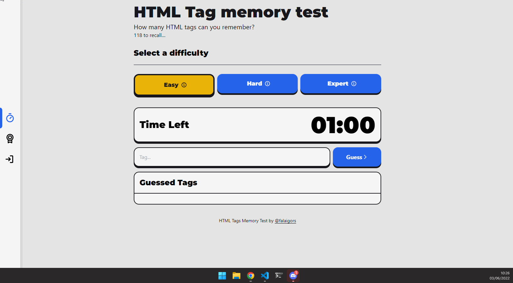

  

  
  
  
    
  

# HTML Tag Memory Test

# 🚀 Tecnologias

Esse projeto foi desenvolvido com as seguintes tecnologias:

- [ViteJS](https://vitejs.dev/)
- [ReactJS](https://reactjs.org)
- [Typescript](https://www.typescriptlang.org/)
- [Tailwind](https://tailwindcss.com/)
- [Zustand](https://github.com/pmndrs/zustand)
- [Immer](https://immerjs.github.io/immer/)
- [Axios](https://axios-http.com/ptbr/)

# 💻 Projeto

A ideia do projeto era desenvolver um jogo onde o usuário pode tentar "descobrir" ou melhor dizendo, lembrar a maior quantidade de HTML Tags em um determinado tempo. 💜

# ⚙️ Funcionalidades

- [x] Countdown
- [x] A cada acerrto adiciona 5s ao countdown
- [x] Modal com resultado total
- [x] Contador de tags adinvinhadas e do tempo total
- [x] Login com Github
- [x] Ranking Top 5
- [x] Níveis de dificuldade

# 🛠️ Ambiente de desenvolvimento

- VSCode ([aqui](https://code.visualstudio.com)), com as seguintes extensões: [**ESLint**](https://marketplace.visualstudio.com/items?itemName=dbaeumer.vscode-eslint), [**Prettier - Code formatter**](https://marketplace.visualstudio.com/items?itemName=esbenp.prettier-vscode), [Babel ES6/ES7](https://marketplace.visualstudio.com/items?itemName=dzannotti.vscode-babel-coloring), [Babel JavaScript](https://marketplace.visualstudio.com/items?itemName=mgmcdermott.vscode-language-babel) e [npm Intellisense](https://marketplace.visualstudio.com/items?itemName=christian-kohler.npm-intellisense)
- NPM (instalado junto com node.js)

## Para executar localmente

- Na raiz do projeto, executar `npm install` para instalar as dependências
- Quando concluído, `npm run dev`
- Acessar através de <http://localhost:3000>

<!-- ## Para executar o conjunto de testes

- Na raiz do projeto, executar `npm install` para instalar as dependências
- Quando concluído, executar `npm run test`
  - Você também pode executar apenas os testes relacionados aos arquivos que alterou com `npm run test:watch`;
  - Você também pode executar para ver a cobertura de teste com `npm run test:coverage` -->

## Para executar um **build**

- Na raiz do projeto, executar `npm install` para instalar as dependências
- Quando concluído, `npm run build`

# 🚧 Features Futuras

- [ ] Ranking dos usuários
- [ ] Cálculo de "Killing on Spree"
- [ ] Perfil do usuário

## 💪 Como contribuir para o projeto

1. Faça um **fork** do projeto.
2. Crie uma nova branch com as suas alterações: `git checkout -b my-feature`
3. Salve as alterações e crie uma mensagem de commit contando o que você fez: `git commit -m "feature: My new feature"`
4. Envie as suas alterações: `git push origin my-feature`

---

## 🦸 Autor

 

 
<b>Igor Santos</b>

 

---

## 📝 Licença

Este projeto esta sobe a licença [MIT](./LICENSE).

Feito com ❤️ por Igor Santos 👋🏽 [Entre em contato!](https://www.linkedin.com/in/falaigor/)
